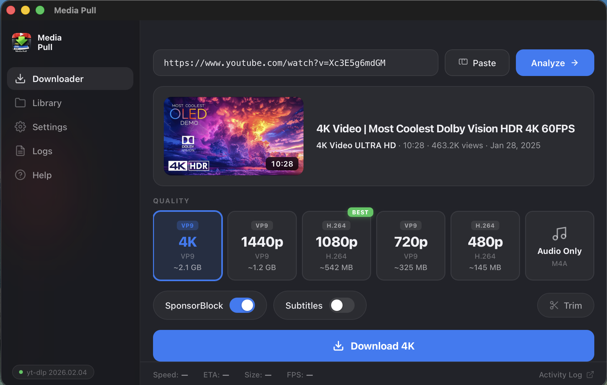
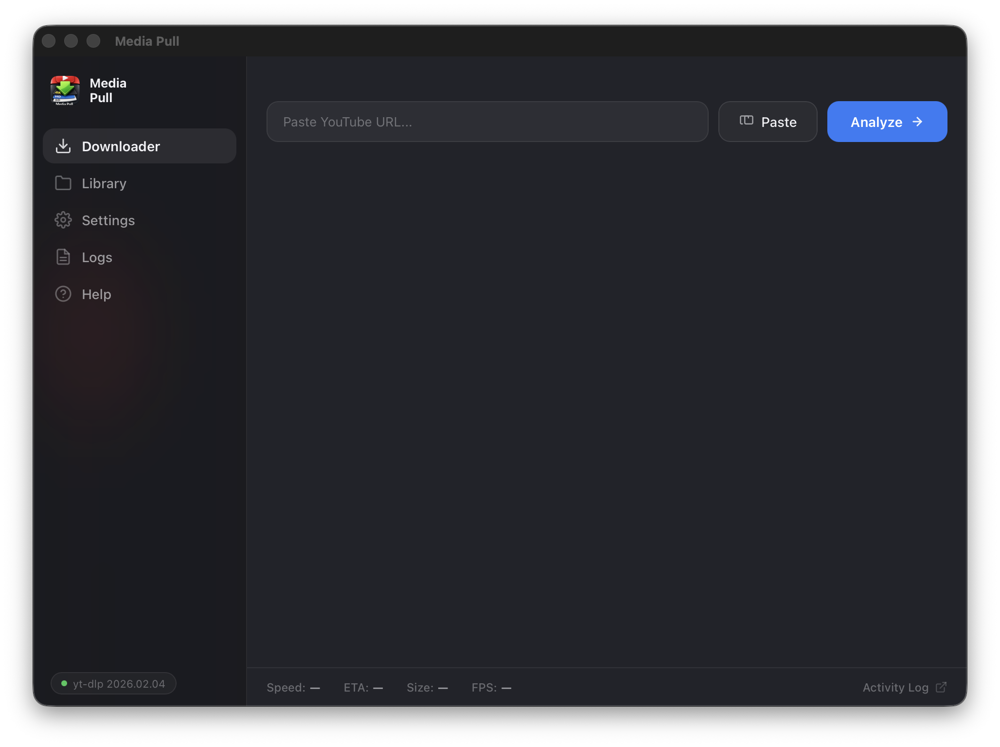
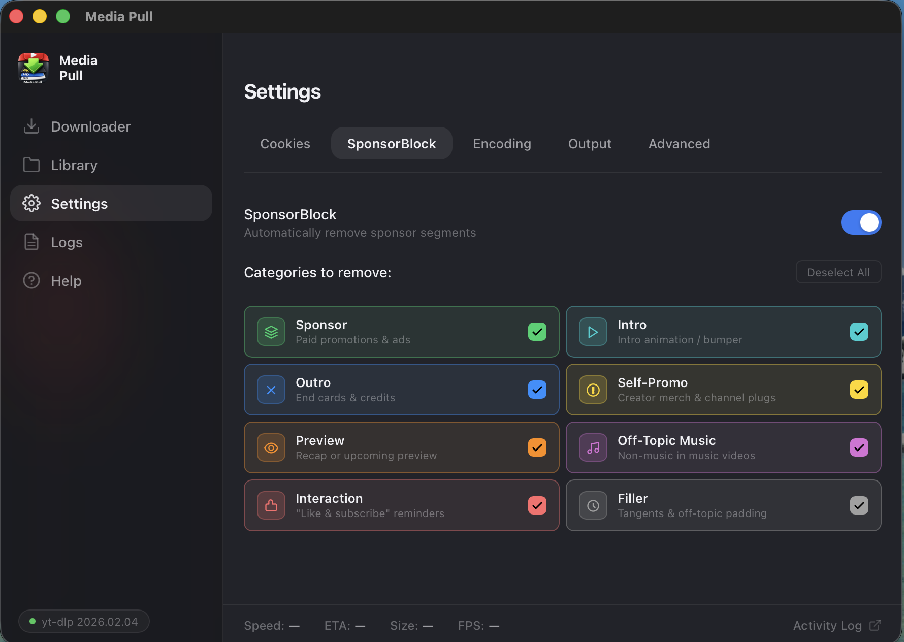
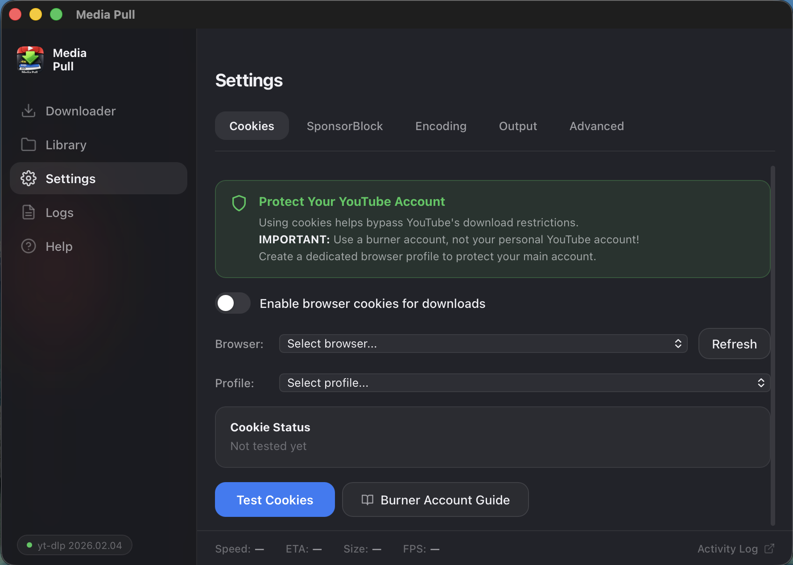
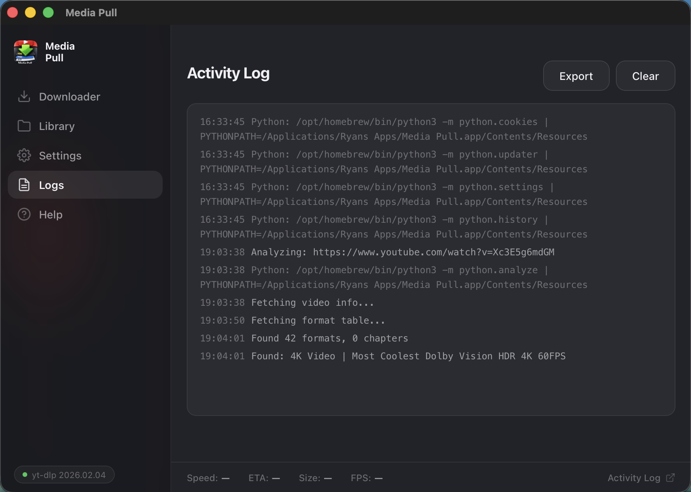
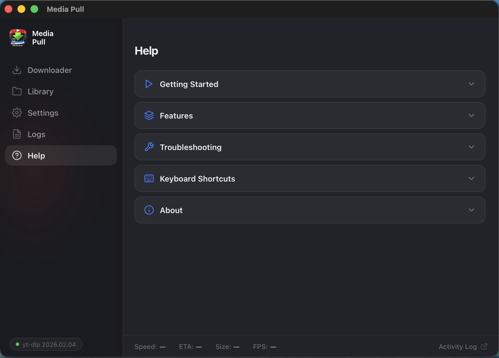

<p align="center">
  
</p>

<h1 align="center">Media Pull</h1>

<p align="center">
  <strong>Download YouTube videos in up to 4K quality with automatic ad & sponsor removal.</strong>
</p>

<p align="center">
  A native macOS desktop app built with Tauri, powered by yt-dlp and ffmpeg.
</p>

<p align="center">
  <a href="https://github.com/bytePatrol/MediaPull/releases/latest"></a>
  <a href="https://github.com/bytePatrol/MediaPull/releases/latest"></a>
  <a href="#license"></a>
  <a href="#"></a>
</p>

<br>

<p align="center">
  
</p>

<br>

## Features

<table>
<tr>
<td width="50%" valign="top">

### Video Downloads
- **Up to 4K resolution** &mdash; 2160p, 1440p, 1080p, 720p, or 480p
- **Audio-only mode** &mdash; extract audio as high-quality M4A
- **Smart format selection** &mdash; best codec per resolution (H.264, VP9, AV1)
- **GPU encoding** &mdash; Apple VideoToolbox with automatic CPU fallback

</td>
<td width="50%" valign="top">

### SponsorBlock Integration
- **Automatic sponsor removal** &mdash; strips ads, intros, outros, and filler
- **Community-powered** &mdash; 8 configurable segment categories
- **Smart auto-disable** &mdash; skips SponsorBlock when downloading chapters

</td>
</tr>
<tr>
<td width="50%" valign="top">

### Chapter Downloads
- **Split by chapter** &mdash; download individual chapters as separate files
- **Instant splitting** &mdash; stream copy, no re-encoding
- **Organized output** &mdash; saves to `Video Title/01 - Chapter Name.mp4`

</td>
<td width="50%" valign="top">

### Playlist Downloads
- **Batch download** &mdash; entire playlists sequentially
- **Selective downloading** &mdash; pick which videos to include
- **Resilient** &mdash; continues to next video on failure
- **Cancellable** &mdash; stop after the current video finishes

</td>
</tr>
</table>

**Plus:** trim/clip support, cookie authentication for age-restricted content, configurable bitrate encoding, searchable download history, one-click yt-dlp updates, real-time progress with speed & ETA, detailed activity logs, and keyboard shortcuts.

---

## Screenshots

<p align="center">
  <picture>
    
  </picture>
</p>
<p align="center">
  <sub>Clean, minimal interface &mdash; paste a URL and hit Analyze</sub>
</p>

<br>

<p align="center">
  <picture>
    
  </picture>
</p>
<p align="center">
  <sub>Pick your quality, toggle SponsorBlock, enable subtitles or trim &mdash; then download</sub>
</p>

<br>

<p align="center">
  <picture>
    
  </picture>
</p>
<p align="center">
  <sub>Fine-tune which sponsor segments to remove with 8 community-powered categories</sub>
</p>

<br>

<details>
<summary><strong>More screenshots</strong></summary>
<br>

<p align="center">
  <picture>
    
  </picture>
</p>
<p align="center">
  <sub>Configure cookies, encoding, output directory, and advanced options</sub>
</p>

<br>

<p align="center">
  <picture>
    
  </picture>
</p>
<p align="center">
  <sub>Full activity log with export capability for debugging</sub>
</p>

<br>

<p align="center">
  <picture>
    
  </picture>
</p>
<p align="center">
  <sub>Built-in help with getting started guide, troubleshooting, and keyboard shortcuts</sub>
</p>

</details>

---

## Installation

### Download

Grab the latest `.dmg` from the [Releases](https://github.com/bytePatrol/MediaPull/releases/latest) page.

1. Open the `.dmg` file
2. Drag **Media Pull** to your Applications folder
3. On first launch, right-click the app and select **Open** (macOS Gatekeeper)

### Requirements

| Dependency | Details |
|---|---|
| **macOS 11+** | Big Sur or later (Apple Silicon native) |
| **yt-dlp** | `brew install yt-dlp` or managed by the app |
| **ffmpeg** | `brew install ffmpeg` or bundled |
| **Python 3.9+** | Included with macOS |

---

## How It Works

Media Pull uses a multi-stage pipeline for maximum quality:

```
Analyze  →  Download Video  →  Download Audio  →  Merge & Encode  →  SponsorBlock  →  Done
               (yt-dlp)          (yt-dlp)         (ffmpeg/GPU)       (optional)
```

1. **Analyze** &mdash; fetches video metadata, available formats, chapters, and thumbnail
2. **Download** &mdash; downloads separate video and audio streams at the highest available quality
3. **Encode** &mdash; merges streams into a single MP4 using hardware-accelerated H.264 encoding
4. **SponsorBlock** &mdash; queries the SponsorBlock API and removes matched segments via ffmpeg
5. **Chapters** (optional) &mdash; splits the encoded file into individual chapter files using stream copy

---

<details>
<summary><strong>Architecture</strong></summary>
<br>

```
┌──────────────────────────────────────────────┐
│              Frontend (HTML/CSS/JS)          │
│   index.html + src/main.js + components/    │
└──────────────┬───────────────────────────────┘
               │  Tauri invoke() / listen()
┌──────────────▼───────────────────────────────┐
│              Rust Backend (Tauri v2)         │
│   src-tauri/src/commands/*.rs               │
│   IPC bridge, process management            │
└──────────────┬───────────────────────────────┘
               │  stdin/stdout JSON lines
┌──────────────▼───────────────────────────────┐
│              Python Modules                  │
│   python/download.py  — download pipeline   │
│   python/analyze.py   — video/playlist info │
│   python/convert.py   — ffmpeg encoding     │
│   python/chapters.py  — chapter splitting   │
│   python/sponsorblock.py — segment removal  │
│   python/cookies.py   — browser cookie mgmt │
└──────────────────────────────────────────────┘
```

- **Frontend** &mdash; vanilla HTML/CSS/JS, no framework, no build step
- **Rust** &mdash; Tauri v2 shell, manages Python subprocesses, emits events to frontend
- **Python** &mdash; each module writes JSON lines to stdout, parsed by Rust in real-time

</details>

<details>
<summary><strong>Building from Source</strong></summary>
<br>

```bash
# Prerequisites
brew install yt-dlp ffmpeg node rust

# Clone
git clone https://github.com/bytePatrol/MediaPull.git
cd MediaPull

# Install JS dependencies
npm install

# Development (hot-reload)
npx tauri dev

# Production build
npm run tauri:build
```

The built app will be at `src-tauri/target/release/bundle/macos/Media Pull.app`.

</details>

<details>
<summary><strong>Configuration</strong></summary>
<br>

Settings are stored in `~/.config/media-pull/`:

| File | Purpose |
|------|---------|
| `config.json` | Output directory and app config |
| `settings.json` | Cookies, SponsorBlock, encoding preferences |
| `history.json` | Download history |

</details>

---

## License

MIT License. See [LICENSE](LICENSE) for details.

---

<p align="center">
  Built with <a href="https://v2.tauri.app">Tauri</a> + <a href="https://github.com/yt-dlp/yt-dlp">yt-dlp</a> + <a href="https://ffmpeg.org">ffmpeg</a>
</p>
